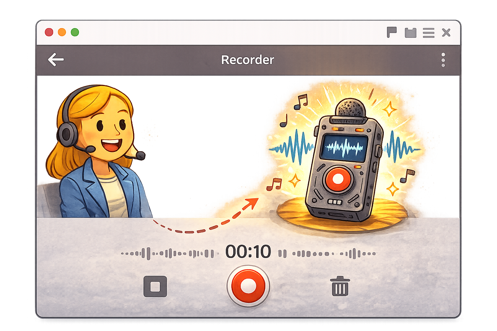

  

<h1 align="center">Le Pupitre - Desktop app for Mac and Windows</h1>

<strong>Record locally. Get coaching signals. Improve every talk.</strong> 
Local-first Tauri coach for conference talks, product demos, pitches, and keynotes. 
A desktop rehearsal workspace for speakers who need clear feedback, private voice data, and consistent progress.

  Start in 10 seconds with the built-in <em>Audio Recorder</em> — no cloud, no accounts, no sharing.

  <a href="#start-here-the-audio-recorder-fastest-way-to-improve">Start here</a>
  &nbsp;·&nbsp;
  <a href="https://lepupitre.app/downloads/">Download</a>
  &nbsp;·&nbsp;
  <a href="docs/README.md">Docs</a>
  &nbsp;·&nbsp;
  <a href="CONTRIBUTING.md">Contributing</a>

 

  

  <em>Rehearse on desktop, get structured feedback, and iterate—without sending your voice to the cloud.</em>

---

  

## Start here: the Audio Recorder - fastest way to improve

  <strong>Press record → speak → get feedback.</strong> 
  The Audio Recorder is the quickest entry into Le Pupitre’s training loop: capture a rehearsal, review pacing and structure,
  and iterate — <strong>without uploading your voice</strong>.

  Train your <strong>opening</strong>, your <strong>timing</strong>, and your <strong>transitions</strong>—then save attempts to compare progress over time.

<strong>What you get immediately</strong>

<ul>
  <li>Duration + pace (WPM) at a glance</li>
  <li>Waveform + checkpoints for structure</li>
  <li>Optional local transcription (Whisper on-device)</li>
  <li>A saved, local history of attempts to track progress</li>
</ul>

<em>Local-first by default: audio, transcripts, and progress stay on your machine.</em>

---

  

## Who it’s for — and why Le Pupitre exists

If you speak for work or school—conference talks, product demos, pitches, team updates, or classroom presentations—Le Pupitre helps you train like it matters. Not by collecting notes, but by making progress visible: timing, pacing, structure, and iteration.

Most people don’t lack motivation—they lack a loop. Practice gets skipped, feedback is vague or delayed, and it’s hard to compare one run to the next. Le Pupitre gives you an evidence-based loop: **record → measure → improve → repeat → deliver**, all the way to **Jour J**.

And because voice data is sensitive, Le Pupitre is **local-first**: recordings, transcripts, and progress stay on your machine by default (with optional on-device Whisper). It’s also **open source**—community-driven and built in the open.

---

## How it works: from rehearsal to <strong>Jour J</strong>

<table>
  <tr>
    <td width="52%">
      <h3>1) Rehearse with live stats</h3>
      

        Run a rehearsal and get immediate metrics: time, pace (WPM), and a clear view of what you’re doing well.
        The goal is not “more practice”—it’s <strong>better practice</strong>.
      

      <ul>
        <li>Time & pace tracking</li>
        <li>Waveform + checkpoints</li>
        <li>Actionable feedback, not vague notes</li>
      </ul>
    </td>
    <td width="48%">
      
    </td>
  </tr>
</table>

<table>
  <tr>
    <td width="48%">
      
    </td>
    <td width="52%">
      <h3>2) Prepare your content + plan your loop</h3>
      

        Turn practice into a routine. Write talking points, rehearse, review, and schedule the next iteration.
        Consistency beats intensity.
      

      <ul>
        <li>Talk writing and structured checkpoints</li>
        <li>Mentor / peer coaching moments</li>
        <li>Calendar-like planning for repeat runs</li>
      </ul>
    </td>
  </tr>
</table>

<table>
  <tr>
    <td width="52%">
      <h3>3) Celebrate progress and share outcomes</h3>
      

        Keep momentum with visible progress and positive reinforcement. Share results when you want, and
        turn rehearsals into a real training routine.
      

      <ul>
        <li>Clear scoring (“Great Job!” moments)</li>
        <li>Shareable progress snapshots</li>
        <li>Progress that stays comparable across runs</li>
      </ul>
    </td>
    <td width="48%">
      
    </td>
  </tr>
</table>

---

## Jour J: deliver with confidence

<table>
  <tr>
    <td width="48%">
      
    </td>
    <td width="52%">
      <h3>On stage</h3>
      

        The end goal is the moment that counts: a clear opening, strong key points, real engagement,
        and a confident closing.
      

      <ul>
        <li>Conference talks and meetups</li>
        <li>Product demos and pitches</li>
        <li>Team updates and keynotes</li>
      </ul>
    </td>
  </tr>
</table>

<table>
  <tr>
    <td width="52%">
      <h3>In the classroom</h3>
      

        “Mon Exposé” becomes a guided structure: introduction → ideas → conclusion.
        Great for students, teachers, and training contexts.
      

    </td>
    <td width="48%">
      
    </td>
  </tr>
</table>

<table>
  <tr>
    <td width="48%">
      
    </td>
    <td width="52%">
      <h3>Online</h3>
      

        Remote talks deserve the same clarity. Practice for video calls, webinars, and distributed teams,
        with audience reactions and pacing in mind.
      

    </td>
  </tr>
</table>

---

## Install and run

- Download installers from [GitHub Releases](https://github.com/esandorfi/lepupitre/releases).
- <strong>macOS</strong> and <strong>Windows</strong> packages are built by CI.
- Current trust note for <code>v0.2.x</code>: installers may still show trust warnings until signing/notarization is fully enabled.

---

## Code signing policy

Free code signing provided by SignPath.io, certificate by SignPath Foundation.

- Policy: [docs/operations/CODE_SIGNING_POLICY.md](docs/operations/CODE_SIGNING_POLICY.md)
- Maintainer and signing roles: [docs/PROJECT_GOVERNANCE.md](docs/PROJECT_GOVERNANCE.md)
- Privacy policy: [PRIVACY.md](PRIVACY.md)

---

## Contributing

Le Pupitre is open source and built in the open. If you want to help, you’re welcome.

- Start here: [CONTRIBUTING.md](CONTRIBUTING.md)
- Documentation portal: [docs/README.md](docs/README.md)
- Code of conduct: [CODE_OF_CONDUCT.md](CODE_OF_CONDUCT.md)
- Security policy: [SECURITY.md](SECURITY.md)
- Worktree sidecar check procedure (Windows):
  [docs/architecture/asr.md#worktree-check-procedure-windows](docs/architecture/asr.md#worktree-check-procedure-windows)

### Documentation model
- [README.md](README.md): product and user onboarding.
- [docs/](docs/README.md): canonical technical and governance documentation.
- [spec/active/](spec/active/README.md): active design proposals.
- [spec/archive/](spec/archive/README.md): historical spec material.

---

## License
Apache-2.0

