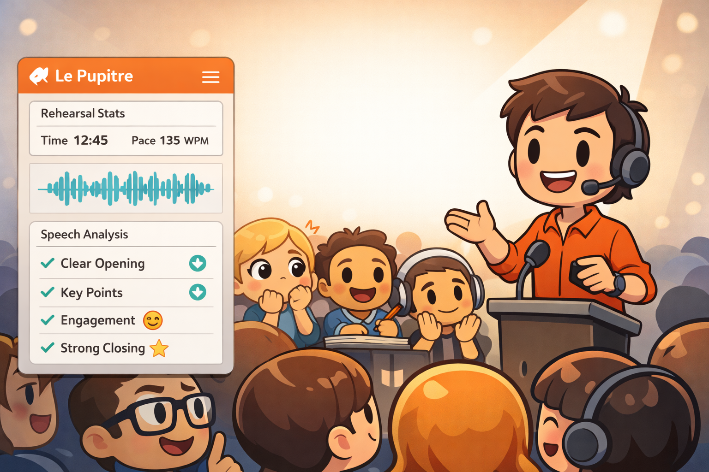
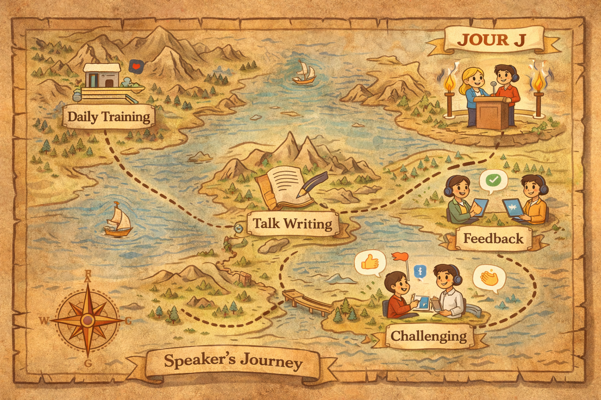

  

<h1 align="center">Le Pupitre - Desktop app for Mac and Windows</h1>

<strong>Practice your voice, keep your data local, improve every talk.</strong>

Local-first Tauri coach for conference talks, product demos, pitches, and keynotes.

A desktop rehearsal workspace for speakers who need clear feedback, private voice data, and consistent progress.

  <a href="https://github.com/esandorfi/lepupitre/releases"><strong>Download</strong></a>
  &nbsp;·&nbsp;
  <a href="docs/README.md">Docs</a>
  &nbsp;·&nbsp;
  <a href="CONTRIBUTING.md">Contributing</a>

 

  

  <em>Rehearse on desktop, get structured feedback, and iterate—without sending your voice to the cloud.</em>

---

## The workflow: from rehearsal to **Jour J**

<table>
  <tr>
    <td width="52%">
      <h3>1) Rehearse with live stats</h3>
      

        Run a rehearsal and get immediate metrics: time, pace (WPM), and a clear view of what you’re doing well.
        The goal is not “more practice”—it’s <strong>better practice</strong>.
      

      <ul>
        <li>Time & pace tracking</li>
        <li>Waveform + checkpoints</li>
        <li>Actionable feedback, not vague notes</li>
      </ul>
    </td>
    <td width="48%">
      
    </td>
  </tr>
</table>

<table>
  <tr>
    <td width="48%">
      
    </td>
    <td width="52%">
      <h3>2) Prepare your content + plan your loop</h3>
      

        Turn practice into a routine. Write talking points, rehearse, review, and schedule the next iteration.
        Consistency beats intensity.
      

      <ul>
        <li>Talk writing and structured checkpoints</li>
        <li>Mentor / peer coaching moments</li>
        <li>Calendar-like planning for repeat runs</li>
      </ul>
    </td>
  </tr>
</table>

<table>
  <tr>
    <td width="52%">
      <h3>3) Celebrate progress and publish outcomes</h3>
      

        Keep momentum with visible progress and positive reinforcement. Share results when you want, and
        turn rehearsals into a real “training program”.
      

      <ul>
        <li>Clear scoring (“Great Job!” moments)</li>
        <li>Shareable progress snapshots</li>
        <li>Publish-ready workflow mindset</li>
      </ul>
    </td>
    <td width="48%">
      
    </td>
  </tr>
</table>

---

## Why Le Pupitre is different

<table>
  <tr>
    <td width="48%">
      
    </td>
    <td width="52%">
      <h3>Local-first by design</h3>
      

        Your recordings and transcripts are sensitive. Le Pupitre is built for privacy and focus:
        the default is <strong>local audio</strong>, <strong>local text</strong>, <strong>local progress</strong>.
      

      <ul>
        <li>Local Whisper transcription (runs on your machine)</li>
        <li>Voice privacy by default: audio and transcripts stay local</li>
        <li>Repeatable training loops: daily quests and “Boss Runs”</li>
        <li>Actionable feedback for the next iteration</li>
      </ul>
    </td>
  </tr>
</table>

---

## Problems it solves : the “Speaker’s Journey”

<table>
  <tr>
    <td width="52%">
      <ul>
        <li><strong>Practice is irregular</strong> and hard to sustain.</li>
        <li><strong>Feedback is vague</strong> or comes too late.</li>
        <li><strong>Voice data is sensitive</strong> (recordings + transcripts).</li>
        <li><strong>Progress is unclear</strong> across repeated runs.</li>
      </ul>
      

        Le Pupitre turns rehearsal into an <strong>evidence-based loop</strong>:
        measure → improve → repeat → deliver.
      

      

        <strong>As a speaker journey</strong>: Daily Training → Talk Writing → Feedback → Challenging → Jour J
        

    </td>
    <td width="48%">
      
    </td>
  </tr>
</table>

---

## Jour J: deliver with confidence

<table>
  <tr>
    <td width="48%">
      
    </td>
    <td width="52%">
      <h3>On stage</h3>
      

        The end goal is the moment that counts: a clear opening, strong key points, real engagement,
        and a confident closing.
      

      <ul>
        <li>Conference talks and meetups</li>
        <li>Product demos and pitches</li>
        <li>Team updates and keynotes</li>
      </ul>
    </td>
  </tr>
</table>

<table>
  <tr>
    <td width="52%">
      <h3>In the classroom</h3>
      

        “Mon Exposé” becomes a guided structure: introduction → ideas → conclusion.
        Great for students, teachers, and training contexts.
      

    </td>
    <td width="48%">
      
    </td>
  </tr>
</table>

<table>
  <tr>
    <td width="48%">
      
    </td>
    <td width="52%">
      <h3>Online</h3>
      

        Remote talks deserve the same clarity. Practice for video calls, webinars, and distributed teams,
        with audience reactions and pacing in mind.
      

    </td>
  </tr>
</table>

---

## Who it is for

- Technical speakers  
- Conference and meetup speakers  
- Product and demo presenters  
- Team leads, founders, and customer-facing presenters  
- Anyone preparing spoken delivery with digital tools  

---

## Install and run

- Download installers from [GitHub Releases](https://github.com/esandorfi/lepupitre/releases).
- **macOS** and **Windows** packages are built by CI.
- Current trust note for `v0.2.x`: installers may still show trust warnings until signing/notarization is fully enabled.

### Quick start
1. Create a profile.
2. Create a talk or demo topic.
3. Complete a first quest (text or audio).
4. Run feedback and review the next actions.

---

## Code signing policy

Free code signing provided by SignPath.io, certificate by SignPath Foundation.

- Policy: [docs/operations/CODE_SIGNING_POLICY.md](docs/operations/CODE_SIGNING_POLICY.md)
- Maintainer and signing roles: [docs/PROJECT_GOVERNANCE.md](docs/PROJECT_GOVERNANCE.md)
- Privacy policy: [PRIVACY.md](PRIVACY.md)

---

## Contributing

- Start here: [CONTRIBUTING.md](CONTRIBUTING.md)
- Documentation portal: [docs/README.md](docs/README.md)
- Code of conduct: [CODE_OF_CONDUCT.md](CODE_OF_CONDUCT.md)
- Security policy: [SECURITY.md](SECURITY.md)
- Worktree sidecar check procedure (Windows):
  [docs/architecture/asr.md#worktree-check-procedure-windows](docs/architecture/asr.md#worktree-check-procedure-windows)

### Documentation model
- [README.md](README.md): product and user onboarding.
- [docs/](docs/README.md): canonical technical and governance documentation.
- [spec/active/](spec/active/README.md): active design proposals.
- [spec/archive/](spec/archive/README.md): historical spec material.

---

## License
Apache-2.0
