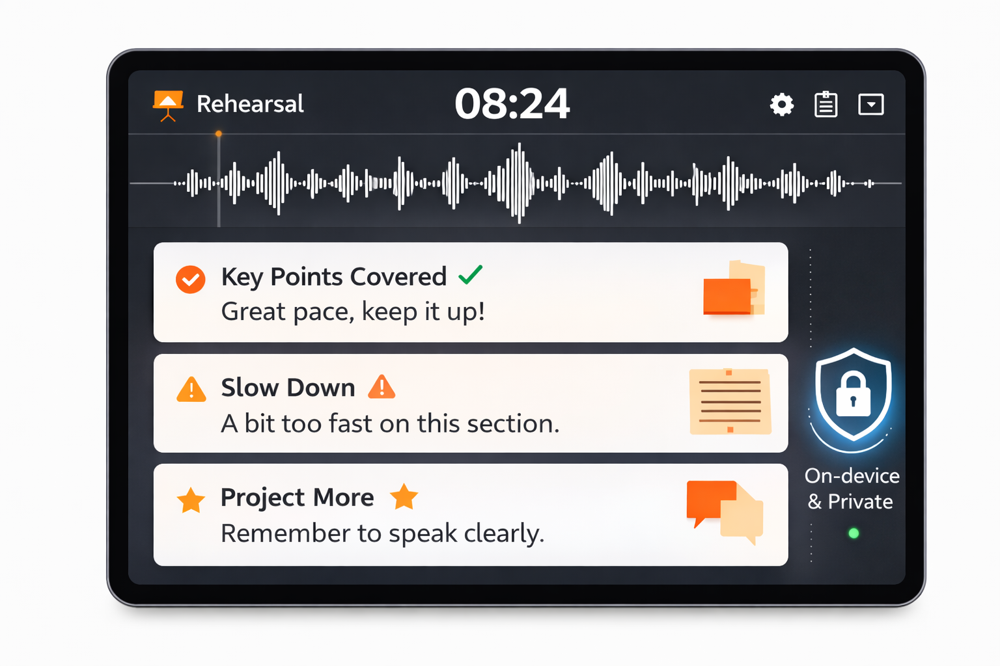

  

<h1 align="center">Le Pupitre</h1>

<strong>Practice your voice, keep your data local, improve every talk.</strong>

Local-first Tauri coach for conference talks, product demos, pitches, and keynotes.

A desktop rehearsal workspace for speakers who need clear feedback, private voice data, and consistent progress.

  <a href="https://github.com/esandorfi/lepupitre/releases">Download</a> |
  <a href="docs/README.md">Docs</a> |
  <a href="CONTRIBUTING.md">Contributing</a>

## Problems it solves
- Practice is irregular and hard to sustain.
- Feedback is often vague or delayed.
- Voice recordings and transcripts are sensitive.
- Progress is hard to measure across repeated runs.

## Why it is different
- Local Whisper transcription runs on your machine.
- Voice privacy by default: audio and transcripts stay local.
- Structured training loops: daily quests and Boss Runs.
- Actionable feedback for the next iteration.

## Who it is for
- Technical speakers
- Conference and meetup speakers
- Product and demo presenters
- Team leads, founders, and customer-facing presenters
- Anyone preparing spoken delivery with digital tools

## Install and run

- Download installers from [GitHub Releases](https://github.com/esandorfi/lepupitre/releases).
- **macOS** and **Windows** packages are built by CI.
- Current trust note for `v0.2.x`: installers may still show trust warnings until signing/notarization is fully enabled.

## Quick start
1. Create a profile.
2. Create a talk or demo topic.
3. Complete a first quest (text or audio).
4. Run feedback and review the next actions.

## Contributing

- Start here: [CONTRIBUTING.md](CONTRIBUTING.md)
- Documentation portal: [docs/README.md](docs/README.md)
- Code of conduct: [CODE_OF_CONDUCT.md](CODE_OF_CONDUCT.md)
- Security policy: [SECURITY.md](SECURITY.md)

## Documentation model

- `README.md`: product and user onboarding.
- `docs/`: canonical technical and governance documentation.
- `spec/active/`: active design proposals.
- `spec/archive/`: historical spec material.

## License
FSL-1.1-MIT (Fair Source License 1.1 with MIT future license)
